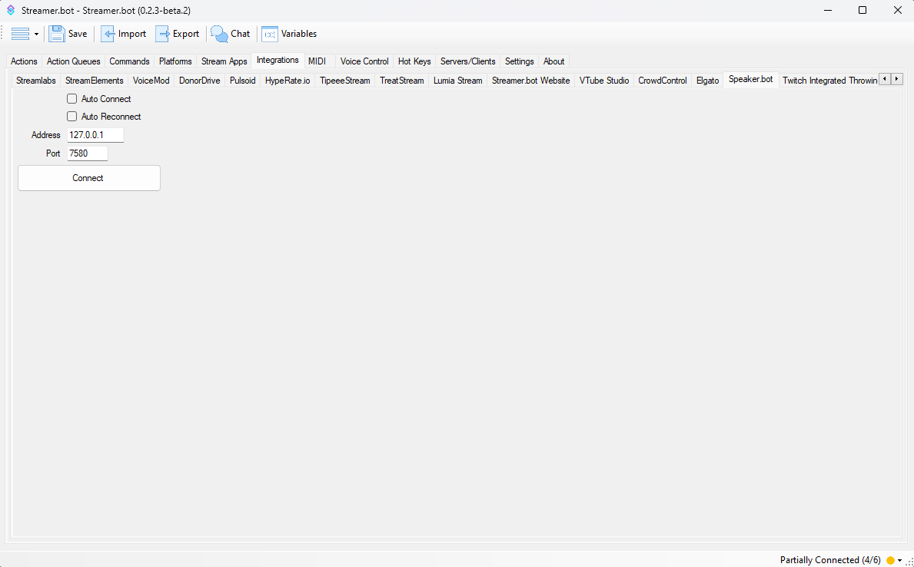

Give your bot a voice with [Speaker.bot](https://speaker.bot){target=_blank} TTS

## Configuration
::callout{icon=i-mdi-navigation}
Navigate to **Integrations > Speaker.bot**
::

::field-group
  ::field{name="Auto Connect" type=Toggle}
    Automatically connect to Speaker.bot when Streamer.bot starts up
  ::

  ::field{name="Auto Reconnect" type=Toggle}
    Automatically reconnect to Speaker.bot when the connection is disrupted
  ::

  ::field{name="Address" type=Text default="127.0.0.1" required}
    Enter the host address of the PC running Speaker.bot

    If Speaker.bot and Streamer.bot are on the same machine, keep `127.0.0.1`

    For multi-pc setups you can configure this with another LAN IP address, e.g. `192.168.1.10`
  ::

  ::field{name="Port" type=Number default=7580 required}
    Enter the port of the Speaker.bot WebSocket server.

    This is should match the configuration at `Settings > WebSocket Server` in Speaker.bot
  ::
::

## Usage
:api-reference-cards{path=speakerbot manifest-path="speaker.bot"}
